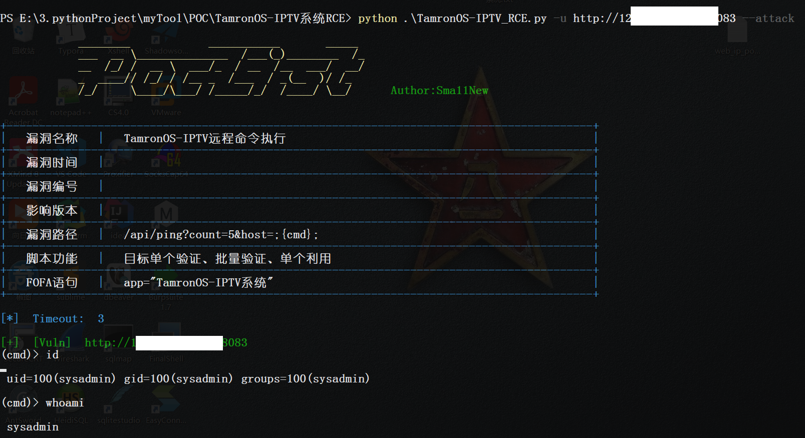
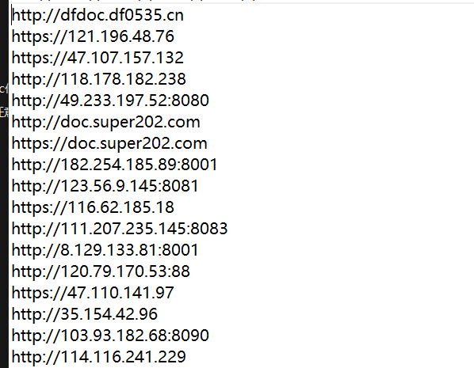
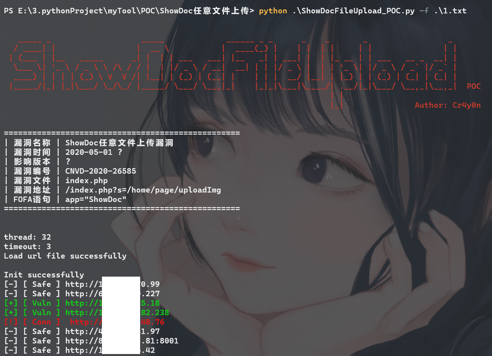
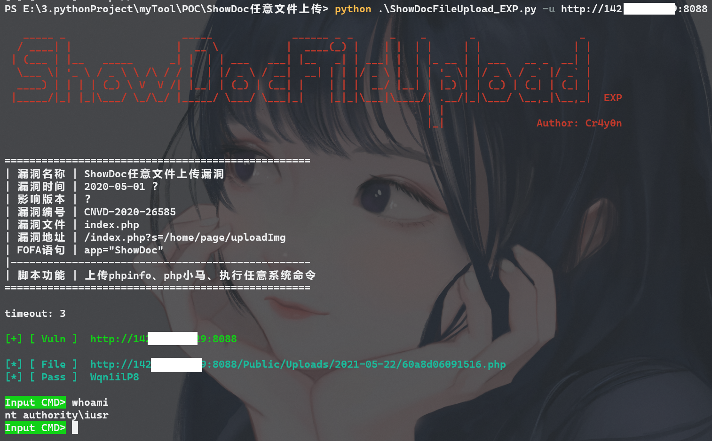

# PocList

自写的漏洞POC和EXP合集。

POC脚本指定url文件后，可多线程批量扫描目标进行验证；EXP脚本可对漏洞进行利用，如文件读取、上传木马、命令执行等。

开发环境：Python 3.7

## 👉2021-08-02 更新

更新如下：

1.  修改UI，将logo更换为项目名PocList
2.  修改漏洞信息显示方式
3.  添加cmd窗口带颜色显示，此前版本cmd窗口颜色解析有误。
4.  **将单个URL的验证和利用与批量验证写在一个文件内，使用-u进行单个验证，-u --attack进行单个利用**

其余使用均相同，-f指定url文件进行批量验证、-t线程数、-T请求超时、-o输出文件名。

单个利用示例：

`python .\TamronOS-IPTV_RCE.py -u http://ip:8083 --attack`



从该POC开始之后的所有POC均使用这种方式，将批量验证、单个验证、单个利用集成在一块，方便使用，之前已经写好的暂时不做修改，使用方式参考下文。

---2021-08-02 更新说明结束

## 👉POC

使用多线程方式批量对目标url进行漏洞探测，并输出结果。

### 参数：

所有POC脚本使用方式均相同。

```
ShowDocFileUpload_POC.py [-h] [-u URL] [-f FILE] [-t THREAD] [-T TIMEOUT] [-o OUTPUT]

optional arguments:
  -u URL, --url URL              目标url，单个验证
  -f FILE, --file FILE           目标url文件，一行一个，批量验证
  -t THREAD, --thread THREAD     线程数，默认32
  -T TIMEOUT, --Timeout TIMEOUT  请求超时，默认3秒
  -o OUTPUT, --output OUTPUT     输出所有存在漏洞的url，默认以当前时间为文件名
```

### 演示：

url文件中一行一个目标，可直接从fofa导出，有无前缀均可：



使用-f参数指定目标文件，即可开始批量扫描，速度极快！



早期的脚本没有设置-u参数，因此只能指定文件，后期脚本可指定-u来单个验证。

## 👉EXP

EXP基础参数只有-u url目标和-T timeout请求超时2个，其余参数依据漏洞情况而定，使用EXP前最好使用-h查看使用方式。

以ShowDoc任意文件上传漏洞为例，-u指定目标后，即可开始利用。



# 说明

本项目用于个人POC记录，内含的POC仅面向合法授权的安全建设行为，请确保您在使用该项目POC时已经取得法律许可，**如您在使用本项目的过程中存在任何非法行为，需自行承担相应后果**，本人不承担任何法律及连带责任。

**使用该项目即代表您同意以上说明。**
